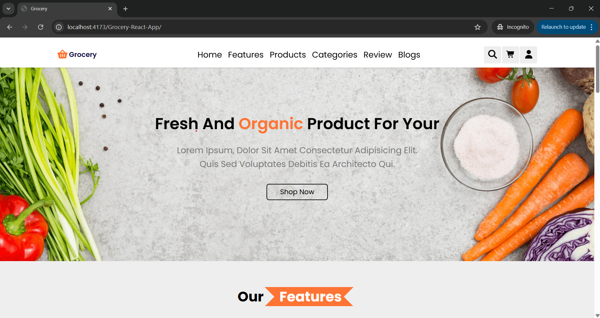

# Tenzies-Game



Interactive and Responsive Grocery-React-App build by React and Typescript

---

## Live Demo

**[View Live Demo Here](https://mohammed-soliman144.github.io/Grocery-React-App/)**

---

## Features:

**Responsive Design:** Works seamlessly on different screen sizes such desktops, tablets and smart phones.
que Identifier.

---

## Technologies Used:

**1- HTML5**
**2- CSS3**
**3- JavaScript (ES6+)**
**4- React**
**5- TypeScript**
**6- SASS**

---

### How To Run Locally:

**Clone The Repo:**

```bash command
git clone https://github.com/mohammed-soliman144/Grocery-React-App.git
```

**Navigate To The Project Directory:**
`bash command cd Grocery-React-App`

**Open 'index.html'** in your browser.

---

## Author:

**Mohammed Soliman**

**[Github Profile](https://github.com/mohammed-soliman144)**

**[Business Email](mohammed-soliman144@gmail.com)**

---

## License:

This Project is Liscensed under the MIT License.
